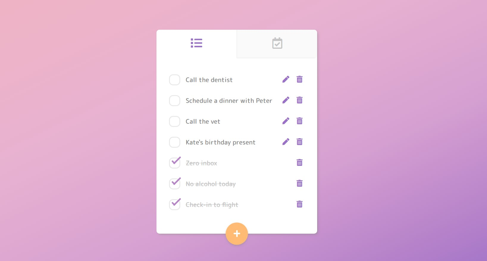
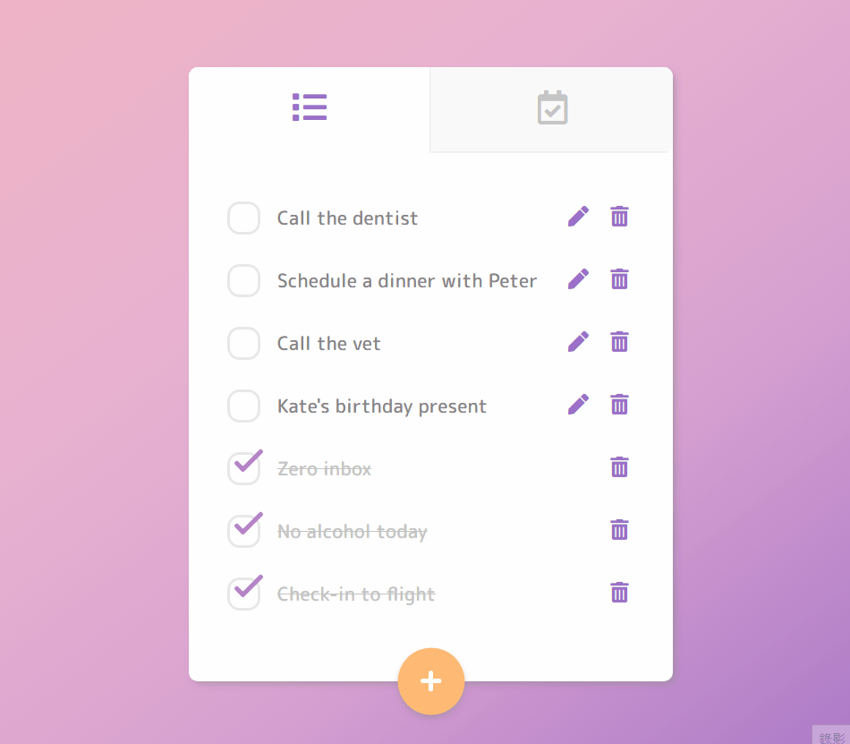
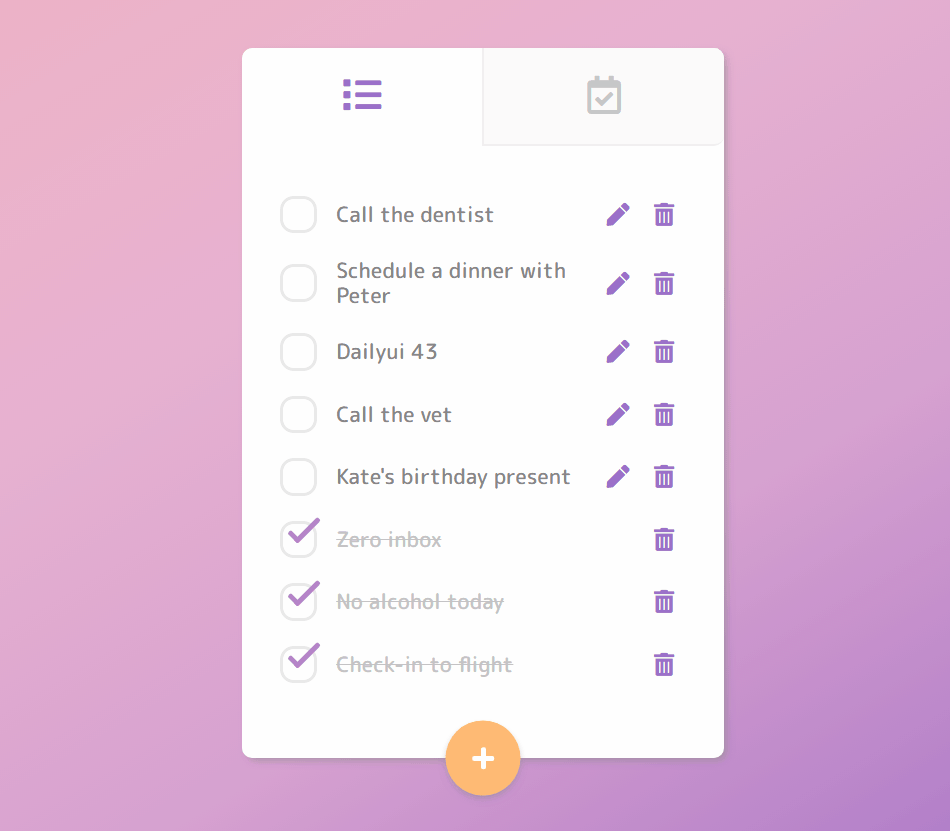
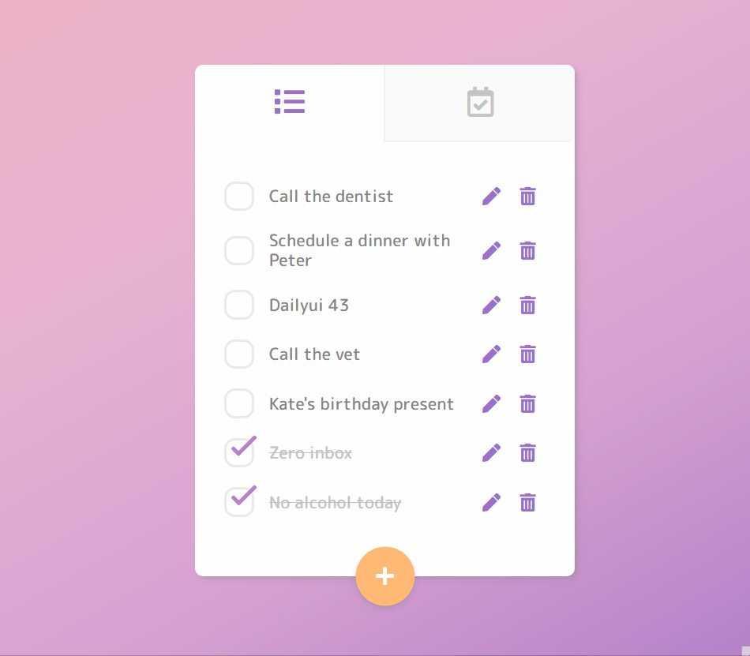
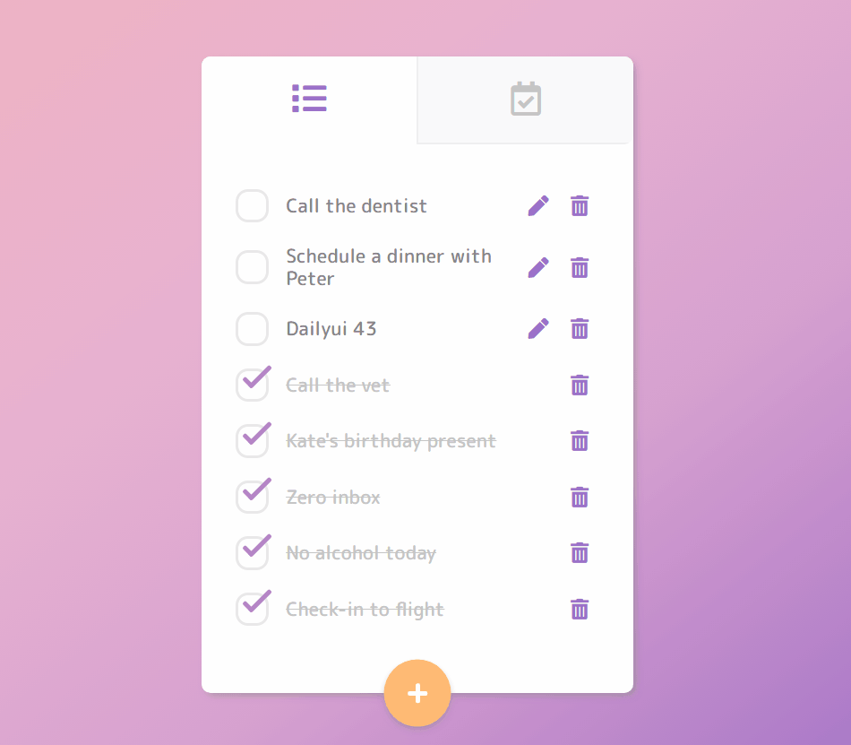

# Todo-list 代辦事項

這是一個代辦事項的 App，主要是用來練習 Vue.js 的一個小專案。

## 大綱

- [總覽](#總覽)
  - [關於這份專案](#關於這份專案)
  - [螢幕截圖](#螢幕截圖)
  - [Demo網站](#Demo網站)
- [使用的工具](#使用的工具)
- [使用方式](#使用方式)
- [參考資源](#參考資源)
- [關於作者](#關於作者)

## 總覽

### 關於這份專案

會建立這份專案，是因為自己最近正在學習 Vue.js，而 Todo-list 正好是一個很好拿來發揮的題材，所以就立馬來嘗試做做看囉！

關於這份專案，除了 [UI（版型）](https://dribbble.com/shots/2458929-DailyUI-042-ToDo-List) 是參考網路上找的以外，其餘部分都是自己從零開始一步一步建立出來的（切版、程式設計、介面優化等等），所以可能會有一些小瑕疵或 Bug。如果你有發現任何問題，都歡迎向我回報。

另外，由於目前專案的進度尚未完成，日後預計還會追加更多功能及優化，所以只是先把目前手上的第一版上傳到這裡當做紀錄。詳細的進度可以參考下面的[專案進度](#專案進度)，或者對於開發細節有興趣的人也可以參考[這裡](https://hackmd.io/wIjkgkihQ1evr6-jnl38Zw)。

### 專案進度

- 2021/11/15 恢復更新（預計重啟時間）
- 2021/10/26 初版完成（暫停更新）

### 螢幕截圖

### Demo網站

[網站連結](https://jubeatt.github.io/Todo-list/)

## 使用的工具

- HTML
- CSS
- Flex-box
- @keyframe
- BEM（Class 命名風格）
- [SCSS](https://sass-lang.com/)（預處理器）
- [Reset.css](https://meyerweb.com/eric/tools/css/reset/)
- [Google font](https://fonts.google.com/)
- [Font-Awesome v5](https://fontawesome.com/v5/changelog/latest)（按鈕圖標）
- [Vue.js v2](https://vuejs.org/v2/guide/)

## 使用方式

1. 添加新任務

2. 修改任務

3. 刪除任務

4. 切換任務顯示列表（所有任務、已完成任務）

## 參考資源

- [Vue.js 官方文檔(v2)](https://cn.vuejs.org/v2/guide/index.html)
- [如何用 CSS 自定義 checkbox 跟 radio 按鈕](https://dev.to/felipperegazio/styling-native-radio-and-checkbox-inputs-css-only-58ci)
- [Day24 Flex 空間分配 flex-grow / flex-shrink / flex-basis](https://ithelp.ithome.com.tw/articles/10208741)
- [Text-decoration - 金魚都能懂的 CSS 必學屬性](https://ithelp.ithome.com.tw/articles/10241263)
- [Codepen-CSS Tooltip Magic](https://codepen.io/tutsplus/pen/WROvdG)
- [[CSS3]如何用 CSS 來改變 Placeholder 這個屬性的文字顏色](https://km.nicetypo.com/doc/9b5fbb27f2d5f7bececcd6f4d8784554)
- [CSS3 gradient background set on body doesn't stretch but instead repeats?](https://stackoverflow.com/questions/2869212/css3-gradient-background-set-on-body-doesnt-stretch-but-instead-repeats)
- [Why doesn't the &lt;input&gt; element respect min-width?](https://stackoverflow.com/questions/29470676/why-doesnt-the-input-element-respect-min-width/29990524)

## 關於作者

- Website - [Jim's blog](https://jubeatt.github.io/)
- Facebook - [薛裕正](https://www.facebook.com/profile.php?id=100003593580513)
